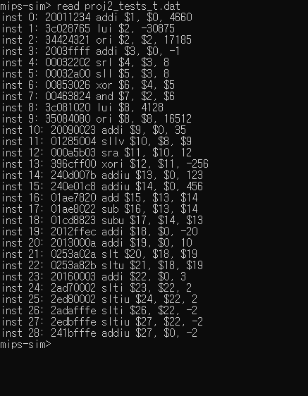
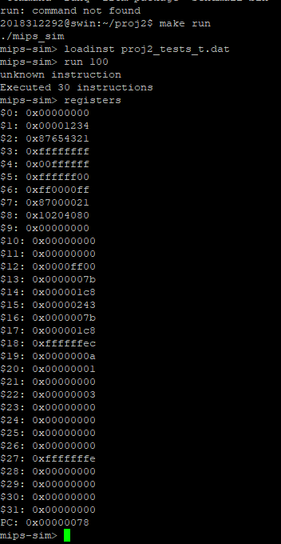

# MIPS_imulator
- MIPS simulator in C

## Decoder
read binary file and print corresponding assembly code
- input: binary file of MIPS machine code(big endian)
- output: print corresponding assembly representation
### Interface
- simple shell
  - **mips-sim>**
  - accept user line command until program exits
  - supported commands
    - **read [filename]** : read [filename] binary file and print the assembly code of it
    - **exit** : finish the program(finish the shell)

### Supported instruction
- logic
  - add, addu, and, div, divu, mult, multu, nor, or, sll, sllv, sra, srav, srl, srlv, sub, subu, xor, addi, addiu, andi,  lui, ori, xori,
- comparison
  - sltiu, slti, slt, sltu
- jump
  - jalr, jr, j, jal
- data movement
  - mfhi, mflo, mthi, mtlo
- branch
  - beq, bne
- load
  - lb, lbu, lh, lhu, lw
- store
  - sb, sh, sw 
- function
  - syscall 
- others
  - unknown instruction

There are some R-type instructions and I-type instructions among supported instructions

### Result
```
inst [inst_no]: [original binary code in hex] [assembly inst] 
```
<p align="center">
   <br/>
  decoder result
</p>

### Filestructure
```
|-- decoder
  |-- main.c
  |-- Makefile
```
- main.c: source code of the project
- Makefile: makefile of the project

### How to run
1. get **main.c, Makefile**
2. enter **make** to prompt to compile 
3. enter **make run** to execute
4. enter **make clean** to erase all generated files
  
## Simulator
read binary file and execute corresponding assembly code and show register states
- input: binary file of MIPS machine code(big endian)
- output: print register state

### Interface
- simple shell
  - **mips-sim>**
  - supported commands
    - **loadinst [filename]** : read binary file and store binary instruction to instruction memory
    - **loaddata [filename]** : read binary data and store the data to data memory
    - **run [N]** : starting at PC address 0x00000000, simulate N instructions, after executing all or error, show the number of executed instructions
    - **registers** : print current value of registers($0 ~ $31, HO, LO and PC) in hex

### Supported instruction
- R-type
  - add, addu, and, nor, or, slt, sltu, sub, subu, xor, div, divu, mfhi, mflo, mthi, mtlo, mult, multu
- shift
  - sll, sllv, sra, srav, srl, srlv
- I-type
  - addi, addiu, andi, lui, ori, slti, sltiu, xori
- memory
  - lw, lh, lhu, lb, lbu, sw, sh, sb
- branch & jump
  - jalr, jr, j, jal, beq, bne 
- system call
  - syscall 

shift, memory, branch & jump and system call instructions are also either R-type or I-type.

### Result
Following are sample instruction(written by decoder above from binary file) and result of simulator
<p align="center">
   <br/>
  instruction sample - written by decoder above
</p>

<p align="center">
   <br/>
  instruction result
</p>

### File structure
```
|-- simulator
  |-- main.c
  |-- Makefile
```

### How to run
1. get **main.c, Makefile**
2. enter **make** to prompt to compile 
3. enter **make run** to execute
4. enter **make clean** to erase all generated files

## 배운점
1. binary 코드 및 사용하고 있는 머신의 endian 방식을 맞추는 방식을 알게 되었다.
2. assembly code가 binary 코드와 1:1 대응하는 성질을 이용하여 binary -> assembly 코드로 변환할 수 있었다.
3. assembly code를 분석하여 register에 저장될 형식을 이해할 수 있었다.
4. syscall을 이용하여 assembly code로 쓰인 bubble sort 코드를 simulator에서 실행하면서 assembly code에서 함수가 어떻게 다뤄지는지, 그 때 register는 어떤 식으로 활용되는지 알 수 있었다.
5. PC로 실행 중인 instruction을 관리할 수 있었다.
6. Makefile 사용법을 익힐 수 있었다.
7. Cloud server, scp를 이용하여 파일을 제출하고 테스트할 수 있었다.

## 한계점
1. main.c로 source code를 통일했기 때문에 가독성 및 관리의 어려움이 있다. 차후 프로젝트를 진행할 때 header file 등을 이용하여 코드를 효율적을 나누는 것이 필요하다.
2. 프로젝트 당시 버전 기록을 하지 않아 시간이 지난 후 프로젝트를 정리할 때 어려움이 있다. Configuration management를 진행하는 것이 필요하다.
3. header comment, comment 등이 빈약하기 때문에 이를 보강할 필요가 있다.
4. document를 작성하지 않아 프로젝트를 전반적으로 관리 및 이해하기 어렵다.
